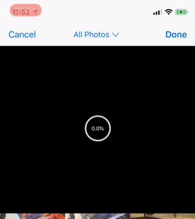
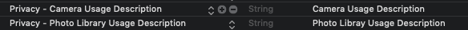

# CropPickerController

[](https://cocoapods.org/pods/CropPickerController)
[](https://cocoapods.org/pods/CropPickerController)
[](https://cocoapods.org/pods/CropPickerController)
[](https://developer.apple.com/swift/)

## Introduce

There is a single image picker controller for cropping and a multi image picker controller for selecting various images. You can select an album and it will be updated automatically when you edit the album.

|Single|Complex|
|---|---|
|||


|Camera|Progress|
|---|---|
|||


## Requirements

`CropPickerController` written in Swift 4.2. Compatible with iOS 8.0+

## Installation

CropPickerController is available through [CocoaPods](https://cocoapods.org). To install
it, simply add the following line to your Podfile:

```ruby
pod 'CropPickerController'
```

### Usage



```swift
import CropPickerController
```

```swift
let cropPickerController = CropPickerController(.single)
// let cropPickerController = CropPickerController(.complex)
cropPickerController.delegate = self
let navigationController = UINavigationController(rootViewController: cropPickerController)
present(navigationController, animated: true, completion: nil)
```

### Init

```Swift

CropPickerController(.single)
CropPickerController(.single, isCamera: true)
CropPickerController(.complex)
CropPickerController(.complex, isCamera: false)

```


### Property

BarButtonItem

```swift

cropPickerController.leftBarButtonItem = UIBarButtonItem(title: "Back", style: .plain, target: cropPickerController, action: #selector(cropPickerController.backTap(_:)))
cropPickerController.rightBarButtonItem = UIBarButtonItem(title: "Crop", style: .done, target: cropPickerController, action: #selector(cropPickerController.cropTap(_:)))

```

color

```swift

cropPickerController.leftBarButtonItem?.tintColor = .black
cropPickerController.rightBarButtonItem?.tintColor = .black
cropPickerController.titleButton.setTitleColor(.black, for: .normal)

cropPickerController.cameraTintColor = .red
cropPickerController.cameraBackgroundColor = UIColor(white: 0.2, alpha: 1)

cropPickerController.pictureDimColor = UIColor(red: 242/255, green: 121/255, blue: 141/255, alpha: 0.5)

cropPickerController.selectBoxTintColor = .black
cropPickerController.selectBoxLayerColor = .gray
cropPickerController.selectBoxBackgroundColor = .gray

cropPickerController.progressTextColor = .black
cropPickerController.progressColor = .red
cropPickerController.progressTintColor = .blue
cropPickerController.progressBackgroundColor = .white

cropPickerController.cropLineColor = .blue
cropPickerController.imageBackgroundColor = .white
cropPickerController.scrollBackgroundColor = .white
cropPickerController.cropDimBackgroundColor = UIColor(white: 0, alpha: 0.9)

```

zoom

```swift

cropPickerController.scrollMinimumZoomScale = 0.1
cropPickerController.scrollMaximumZoomScale = 12

```

text

```Swift

cropPickerController.permissionGalleryDeniedTitle = "Denied"
cropPickerController.permissionGalleryDeniedMessage = "Denied Gallery"
cropPickerController.permissionCameraDeniedTitle = "Denied"
cropPickerController.permissionCameraDeniedMessage = "Denied Camera"
cropPickerController.permissionActionMoveTitle = "Move~"
cropPickerController.permissionActionCancelTitle = "Cancel!"

```

### Selector

Back and Crop

```swift

#selector(cropPickerController.backTap(_:))
#selector(cropPickerController.cropTap(_:))

```

### Delegate

```swift

class ViewController: UIViewController{
    override func viewDidLoad() {
        super.viewDidLoad()

        let cropPickerController = CropPickerController(.single)
        cropPickerController.delegate = self
    }
}

// MARK: CropPickerDelegate
extension ViewController: CropPickerDelegate {
    func cropPickerBackAction(_ cropPickerController: CropPickerController) {

    }
    func cropPickerCompleteAction(_ cropPickerController: CropPickerController, images: [UIImage]?, error: Error?) {

    }
}

```

## Author

pikachu987, pikachu77769@gmail.com

## License

CropPickerController is available under the MIT license. See the LICENSE file for more info.
